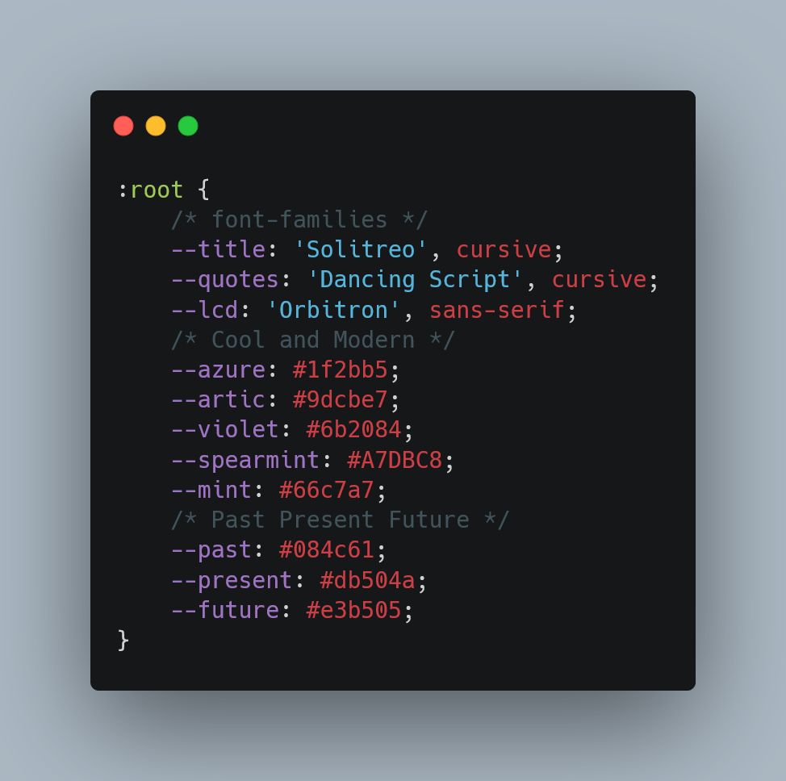

## Daily-Planner-Day.js  

## Introduction 
Here is another planner that I created for Coding BootCamp and my current job

## Language Uses

### 
On HTML. I have included the classes below. I have mostly use BootStrap method to save time.
* Jumbotron/Heros
* Container/Container-fluid. Container will have 14 rows with md 1-10-1 to able to have three column inside the row.
* Classes will be including from am6-am19 for BlockId function on JS.
* I have also included a link to fontawesome icons

### 
On CSS. I used 3 fonts from GoogleFonts and Color Palette. My favorite part of this class. Styling
* As always, I included a :root method and you can see the snippet below that I made by carbon.
* One thing I have noticed about CSS with bootstrap is you have to be particular about classes.
* I also included a @media queries to make sure btn are center since I most likely will use this for work on my iPhone

### 

## References
https://github.com/Naereen/badges/blob/master/README.md
